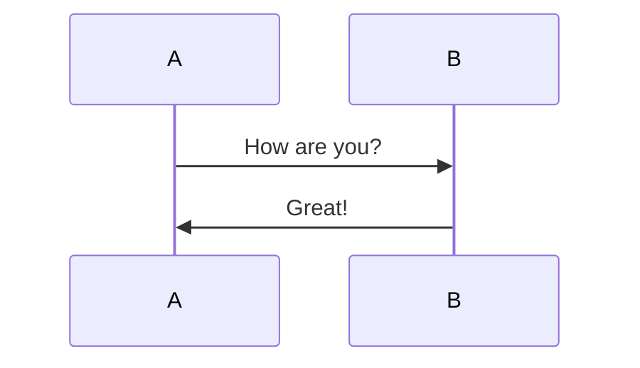

### 快捷键

#### 标题

`Ctrl 0`到`Ctrl 6`： **一级文本~六级文本**

#### 加粗

`Ctrl B`： 加粗；**加粗测试**

#### 斜体

`Ctrl I`： 斜体；*斜体测试*

#### 下划线

`Ctrl U`： 下划线；<u>下划线测试</u>

#### 删除线

`Shift Alt 5`： 删除线；~~删除线测试~~

#### 行内代码块

`Shift Ctrl ~`： 行内代码块；`行内代码块测试`

#### 超链接

`Ctrl K`： 超链接，[超链接测试；欢迎点一个大大的关注！！！]([《LL》 - 博客园 (cnblogs.com)](https://www.cnblogs.com/liulia/))；还支持文章内锚点，按**Ctrl** 键点击此处 👉[第一节](https://www.cnblogs.com/liulia/p/14837982.html#Markdown快速入门常用快捷键（typora）)

#### 表格

`Ctrl T`： 表格，支持拖拽移动、网页端表格复制转换

#### 引用

`Ctrl Shift Q`： 引用；

#### 插入图片

`Shift Ctrl I`： 插入图片；

#### 公式块

`Shift Ctrl M`： 公式块；

### 行内语法

#### **任务**

```
- [ ] 任务一 未做任务 `- + 空格 + [ ]`
- [x] 任务二 已做任务 `- + 空格 + [x]`
```

- [ ] 任务一 未做任务 
- [x] 任务二 已做任务 

#### **无序列表**

```
* 无序列表项 一
+ 无序列表项 二
- 无序列表项 三
```

#### **有序列表**

```
1. 有序列表项 一
2. 有序列表项 二
3. 有序列表项 三
```

#### **多级引用**

引用需要在被引用的文本前加上>符号和空格，允许多层嵌套，也允许你偷懒只在整个段落的第一行最前面加上 > 。

```
>>> 请问 Markdwon 怎么用？ - 小白
>> 自己看教程！ - 愤青
> 教程在哪？ - 小白
```

> >> 请问 Markdwon 怎么用？ - 小白

> > 自己看教程！ - 愤青

> 教程在哪？ - 小白

#### **行内式**

```
C语言里的函数 `scanf()` 怎么使用？
```

#### 流程图

```
​```mermaid
graph LR
A-->B
​```

​```mermaid
sequenceDiagram
A->>B: How are you?
B->>A: Great!
​```
```




#### 分隔线

```
* * *
***
*****
- - -
-----------
```

